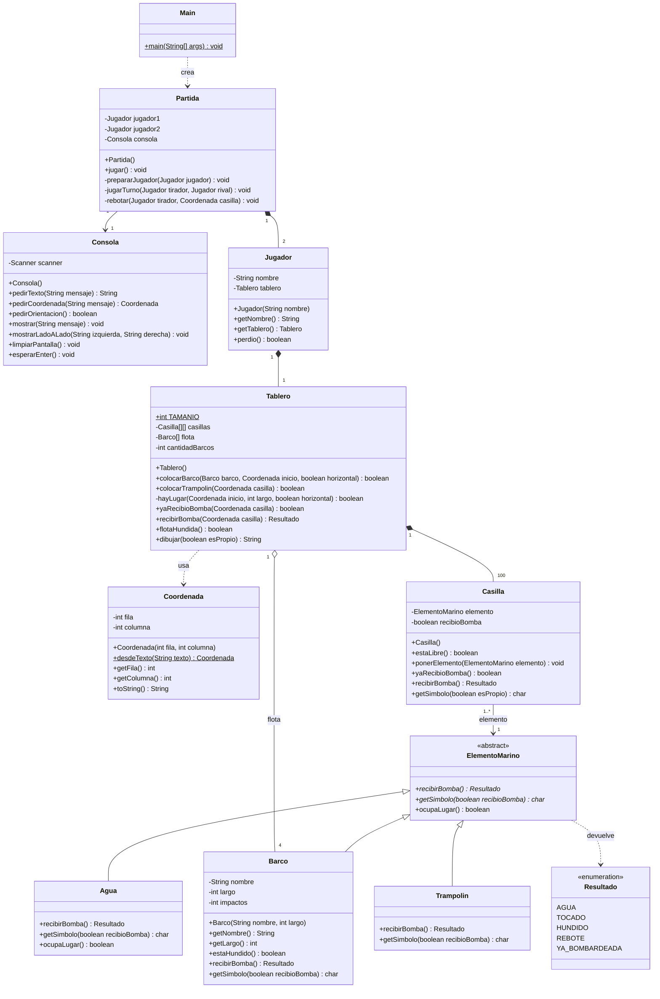
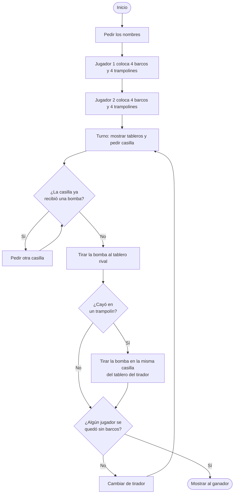
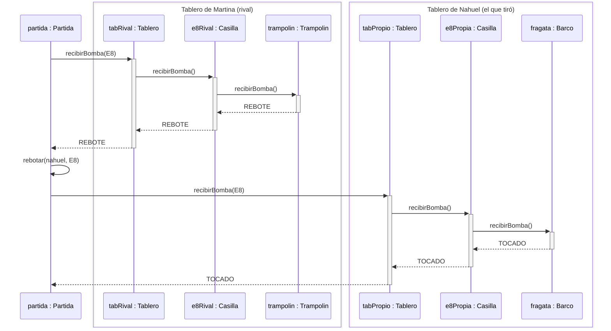

# Batalla Naval con Trampolines — Documento técnico

Paradigma Orientado a Objetos · UADE · 2.º cuatrimestre 2026

Este documento es la referencia para programar el juego: qué clases hay, qué hace cada método, cómo se conectan y en qué orden conviene implementarlas. Las reglas para jugar están en el manual, en esta misma carpeta ([`Manual_Batalla_Naval_con_Trampolines.docx`](Manual_Batalla_Naval_con_Trampolines.docx)); acá se citan por su número.

- **Lenguaje:** Java, por consola, sin librerías externas (solo `java.util.Scanner`).
- **Clases:** 12, una por archivo `.java`, todas en el paquete por defecto.
- **Idea central:** cada casilla guarda un `ElementoMarino` (agua, barco o trampolín) y cada uno responde a la bomba a su manera. Así el tablero nunca tiene que preguntar qué hay en una casilla.

## Índice

1. [Estructura del repositorio](#1-estructura-del-repositorio)
2. [Diagrama de clases](#2-diagrama-de-clases)
3. [Detalle de cada clase](#3-detalle-de-cada-clase)
4. [Flujo del programa](#4-flujo-del-programa)
5. [Un disparo con rebote](#5-un-disparo-con-rebote)
6. [Dónde se cumple cada regla](#6-dónde-se-cumple-cada-regla)
7. [Conceptos de POO en el diseño](#7-conceptos-de-poo-en-el-diseño)
8. [Plan de trabajo por etapas](#8-plan-de-trabajo-por-etapas)
9. [Casos de prueba](#9-casos-de-prueba)

---

## 1. Estructura del repositorio

Todo el TPO va en la carpeta `TPO/`, separada de las carpetas de cada clase:

```text
paradigma-grupo5/
├── README.md
├── .gitignore
├── clase-02/ … clase-04/          ejercicios de cada clase
└── TPO/
    ├── DOCUMENTO_TECNICO.md       este documento
    ├── Manual_Batalla_Naval_con_Trampolines.docx
    └── src/                       se agrega a partir de la etapa 1
        ├── Main.java
        ├── Partida.java
        ├── Consola.java
        ├── Jugador.java
        ├── Tablero.java
        ├── Casilla.java
        ├── Coordenada.java
        ├── Resultado.java
        ├── ElementoMarino.java
        ├── Agua.java
        ├── Barco.java
        └── Trampolin.java
```

**Compilar y ejecutar** desde la carpeta `TPO/`:

```bash
cd TPO
javac -encoding UTF-8 -d out src/*.java
java -cp out Main
```

`-encoding UTF-8` evita problemas con las tildes y la ñ de los mensajes. Si usan IntelliJ o Eclipse, marquen `TPO/src/` como carpeta de fuentes.

El `.gitignore` del repositorio ya ignora `out/`, `*.class`, `.idea/`, `*.iml` y `.DS_Store`, así que no se suben archivos compilados ni de configuración del editor.

---

## 2. Diagrama de clases



Rombo lleno = composición (la parte no existe sin el todo). Rombo vacío = agregación. Triángulo = herencia. Flecha punteada = dependencia. `$` = `static` y `*` = abstracto.

---

## 3. Detalle de cada clase

Las clases están ordenadas de abajo hacia arriba: primero las que no dependen de ninguna otra. Es el mismo orden en que conviene programarlas.

Todos los atributos son `private`. Los nombres van en español y en camelCase, y las constantes en MAYÚSCULAS.

### 3.1 `Resultado` (enum)

Lo que puede pasar cuando una bomba cae en una casilla.

| Valor | Cuándo |
| --- | --- |
| `AGUA` | La casilla tenía agua. |
| `TOCADO` | Le dio a un barco que todavía no se hundió. |
| `HUNDIDO` | Le dio a la última parte sana de un barco. |
| `REBOTE` | Cayó en un trampolín. |
| `YA_BOMBARDEADA` | La casilla ya había recibido una bomba. Solo pasa en un rebote, porque en un disparo normal la `Partida` no deja tirar dos veces al mismo lugar. |

```java
public enum Resultado {
    AGUA, TOCADO, HUNDIDO, REBOTE, YA_BOMBARDEADA
}
```

Si todavía no vieron `enum`, puede ser una clase con constantes `String` (`public static final String AGUA = "AGUA";`) y comparar con `equals`.

### 3.2 `ElementoMarino` (clase abstracta)

Cualquier cosa que puede haber en una casilla. No se crean objetos de esta clase, solo de sus hijas.

| Método | Devuelve | Qué hace |
| --- | --- | --- |
| `recibirBomba()` | `Resultado` | **Abstracto.** Cada subclase dice qué pasa cuando le cae una bomba. |
| `getSimbolo(boolean recibioBomba)` | `char` | **Abstracto.** El carácter que se dibuja, según si la casilla ya recibió una bomba. |
| `ocupaLugar()` | `boolean` | Devuelve `true`: la casilla está ocupada. `Agua` lo redefine. |

### 3.3 `Agua`, `Barco` y `Trampolin` (heredan de `ElementoMarino`)

Las tres responden los mismos mensajes, cada una a su manera:

| Método | `Agua` | `Barco` | `Trampolin` |
| --- | --- | --- | --- |
| `recibirBomba()` | `AGUA` | Suma 1 a `impactos`. Devuelve `HUNDIDO` si `impactos` llegó a `largo`, si no `TOCADO`. | `REBOTE` |
| `getSimbolo(false)` | `~` | `B` | `T` |
| `getSimbolo(true)` | `O` | `X` | `R` |
| `ocupaLugar()` | `false` | `true` (heredado) | `true` (heredado) |

`Barco` además tiene:

| Atributo | Tipo | Qué guarda |
| --- | --- | --- |
| `nombre` | `String` | "Lancha", "Fragata" o "Acorazado". Se usa en los mensajes de colocación. |
| `largo` | `int` | Cuántas casillas ocupa (2, 3 o 4). |
| `impactos` | `int` | Cuántas bombas recibió. Arranca en 0. |

| Método | Devuelve | Qué hace |
| --- | --- | --- |
| `Barco(String nombre, int largo)` | — | Guarda nombre y largo; `impactos` arranca en 0. |
| `getNombre()`, `getLargo()` | `String`, `int` | Getters. |
| `estaHundido()` | `boolean` | `impactos >= largo`. |

```java
// Barco
public Resultado recibirBomba() {
    impactos++;
    if (estaHundido()) {
        return Resultado.HUNDIDO;
    }
    return Resultado.TOCADO;
}
```

Un barco ocupa varias casillas, pero es **un solo objeto**: todas sus casillas apuntan al mismo `Barco`. Por eso, cuando `impactos` llega al largo, el barco sabe que está hundido.

### 3.4 `Coordenada`

Una fila y una columna del tablero, las dos de 0 a 9 (como los índices de la matriz).

| Atributo | Tipo | Qué guarda |
| --- | --- | --- |
| `fila` | `int` | 0 = A, 9 = J. |
| `columna` | `int` | 0 = columna 1, 9 = columna 10. |

| Método | Devuelve | Qué hace |
| --- | --- | --- |
| `Coordenada(int fila, int columna)` | — | Guarda fila y columna. |
| `desdeTexto(String texto)` | `Coordenada` | **`static`.** Convierte lo que escribe el jugador en una coordenada. Si el texto no es válido, devuelve `null`. |
| `getFila()`, `getColumna()` | `int` | Getters. |
| `toString()` | `String` | La casilla como la escribe el jugador, por ejemplo `"E8"`. |

Ejemplos de `desdeTexto`:

| Texto | Resultado |
| --- | --- |
| `"B7"` | fila 1, columna 6 |
| `"j10"` | fila 9, columna 9 |
| `" e8 "` | fila 4, columna 7 (se ignoran espacios y mayúsculas) |
| `"K3"`, `"A0"`, `"A11"`, `"7B"`, `"hola"`, `""` | `null` |

```java
public static Coordenada desdeTexto(String texto) {
    texto = texto.trim().toUpperCase();
    if (texto.length() < 2 || texto.length() > 3) {
        return null;
    }
    char letra = texto.charAt(0);
    if (letra < 'A' || letra > 'J') {
        return null;
    }
    String numeroTexto = texto.substring(1);
    for (int i = 0; i < numeroTexto.length(); i++) {
        if (!Character.isDigit(numeroTexto.charAt(i))) {
            return null;
        }
    }
    int numero = Integer.parseInt(numeroTexto);
    if (numero < 1 || numero > 10) {
        return null;
    }
    return new Coordenada(letra - 'A', numero - 1);
}
```

Chequear que sean dígitos antes de `Integer.parseInt` evita tener que usar `try/catch`.

### 3.5 `Casilla`

Un lugar del tablero.

| Atributo | Tipo | Qué guarda |
| --- | --- | --- |
| `elemento` | `ElementoMarino` | Lo que hay en la casilla. Arranca con `new Agua()`. |
| `recibioBomba` | `boolean` | Si ya le cayó una bomba. Arranca en `false`. |

| Método | Devuelve | Qué hace |
| --- | --- | --- |
| `Casilla()` | — | Pone `new Agua()` y `recibioBomba = false`. |
| `estaLibre()` | `boolean` | `!elemento.ocupaLugar()`: solo está libre si tiene agua. |
| `ponerElemento(ElementoMarino elemento)` | `void` | Reemplaza el agua por un barco o un trampolín. |
| `yaRecibioBomba()` | `boolean` | Getter de `recibioBomba`. |
| `recibirBomba()` | `Resultado` | Marca `recibioBomba = true` y le pasa la bomba al elemento. |
| `getSimbolo(boolean esPropio)` | `char` | Si la mira el rival y no recibió bomba, devuelve `~` (así no se ven los barcos ni los trampolines). Si no, le pide el símbolo al elemento. |

```java
public Resultado recibirBomba() {
    recibioBomba = true;
    return elemento.recibirBomba();   // no pregunta qué tiene: cada elemento responde a su manera
}

public char getSimbolo(boolean esPropio) {
    if (!esPropio && !recibioBomba) {
        return '~';
    }
    return elemento.getSimbolo(recibioBomba);
}
```

### 3.6 `Tablero`

La matriz de 10 x 10 casillas y la flota de un jugador.

| Atributo | Tipo | Qué guarda |
| --- | --- | --- |
| `TAMANIO` | `int` | `public static final int TAMANIO = 10;` |
| `casillas` | `Casilla[][]` | Las 100 casillas. Se crean todas en el constructor. |
| `flota` | `Barco[]` | Los 4 barcos del jugador, para saber si se hundieron todos. |
| `cantidadBarcos` | `int` | Cuántos barcos se colocaron (posición libre en `flota`). |

| Método | Devuelve | Qué hace |
| --- | --- | --- |
| `Tablero()` | — | Crea la matriz, llena las 100 casillas con `new Casilla()` y crea `flota = new Barco[4]`. |
| `colocarBarco(Barco barco, Coordenada inicio, boolean horizontal)` | `boolean` | Si hay lugar, pone el mismo objeto `barco` en todas sus casillas, lo agrega a `flota` y devuelve `true`. Si no, no cambia nada y devuelve `false`. Horizontal avanza hacia la derecha; vertical, hacia abajo. |
| `hayLugar(Coordenada inicio, int largo, boolean horizontal)` | `boolean` | **Privado.** `true` si todas las casillas que ocuparía el barco están dentro del tablero y libres. |
| `colocarTrampolin(Coordenada casilla)` | `boolean` | Si la casilla está libre, pone un `new Trampolin()` y devuelve `true`. Si no, `false`. |
| `yaRecibioBomba(Coordenada casilla)` | `boolean` | Pregunta a esa casilla. |
| `recibirBomba(Coordenada casilla)` | `Resultado` | Si la casilla ya recibió bomba, devuelve `YA_BOMBARDEADA`. Si no, devuelve lo que diga `casilla.recibirBomba()`. |
| `flotaHundida()` | `boolean` | `true` si todos los barcos de `flota` están hundidos. |
| `dibujar(boolean esPropio)` | `String` | El tablero como texto, 11 líneas separadas por `"\n"` (ver abajo). `esPropio` = `true` para el dueño, `false` para el rival. |

```java
private boolean hayLugar(Coordenada inicio, int largo, boolean horizontal) {
    for (int i = 0; i < largo; i++) {
        int fila = inicio.getFila();
        int columna = inicio.getColumna();
        if (horizontal) {
            columna = columna + i;
        } else {
            fila = fila + i;
        }
        if (fila >= TAMANIO || columna >= TAMANIO) {
            return false;                     // se sale del tablero (regla 4)
        }
        if (!casillas[fila][columna].estaLibre()) {
            return false;                     // pisa otra pieza (regla 5)
        }
    }
    return true;
}
```

`colocarBarco` recorre las mismas casillas que `hayLugar`, pero llamando a `ponerElemento(barco)`.

**Formato de `dibujar`.** Una línea con los números de columna y una por fila. Cada símbolo va separado por un espacio:

```text
   1 2 3 4 5 6 7 8 9 10
A  ~ B X B B ~ ~ ~ ~ ~
B  ~ ~ ~ ~ ~ ~ ~ ~ T ~
...
J  ~ ~ ~ ~ ~ B ~ ~ ~ T
```

La primera línea son 3 espacios y los números del 1 al 10. Cada fila es la letra (`(char) ('A' + fila)`), 2 espacios y los 10 símbolos de `casillas[fila][columna].getSimbolo(esPropio)`.

### 3.7 `Jugador`

| Atributo | Tipo | Qué guarda |
| --- | --- | --- |
| `nombre` | `String` | El nombre que escribió. |
| `tablero` | `Tablero` | Su tablero. Se crea en el constructor. |

| Método | Devuelve | Qué hace |
| --- | --- | --- |
| `Jugador(String nombre)` | — | Guarda el nombre y crea `new Tablero()`. |
| `getNombre()`, `getTablero()` | `String`, `Tablero` | Getters. |
| `perdio()` | `boolean` | `tablero.flotaHundida()`. |

### 3.8 `Consola`

La **única** clase que usa `Scanner` y `System.out`. Las demás no leen ni imprimen nada: le piden a la `Consola` que lo haga.

| Método | Devuelve | Qué hace |
| --- | --- | --- |
| `Consola()` | — | Crea `new Scanner(System.in)`. |
| `pedirTexto(String mensaje)` | `String` | Muestra el mensaje y lee una línea. Si está vacía, la vuelve a pedir. Devuelve el texto sin espacios al principio ni al final. |
| `pedirCoordenada(String mensaje)` | `Coordenada` | Pide texto hasta que `Coordenada.desdeTexto` devuelva algo distinto de `null`. Si es inválido, avisa: *"Casilla inválida. Escribí una letra de la A a la J y un número del 1 al 10, por ejemplo B7."* |
| `pedirOrientacion()` | `boolean` | Pide H o V (acepta minúsculas) hasta que sea una de las dos. Devuelve `true` si es horizontal. |
| `mostrar(String mensaje)` | `void` | `System.out.println(mensaje)`. |
| `mostrarLadoALado(String izquierda, String derecha)` | `void` | Imprime dos textos de varias líneas uno al lado del otro. Se usa para mostrar los dos tableros juntos. |
| `limpiarPantalla()` | `void` | Imprime 50 líneas en blanco para que el otro jugador no vea nada. |
| `esperarEnter()` | `void` | Muestra *"Presioná Enter para seguir..."* y espera un `nextLine()`. |

```java
public void mostrarLadoALado(String izquierda, String derecha) {
    String[] lineasIzq = izquierda.split("\n");
    String[] lineasDer = derecha.split("\n");
    for (int i = 0; i < lineasIzq.length; i++) {
        String linea = lineasIzq[i];
        while (linea.length() < 27) {
            linea = linea + " ";              // columna fija para el segundo tablero
        }
        System.out.println(linea + lineasDer[i]);
    }
}
```

Los dos textos tienen que tener la misma cantidad de líneas. La `Partida` le pasa `"TU TABLERO\n" + propio.dibujar(true)` y `"TABLERO DE MARTINA\n" + rival.dibujar(false)`: 12 líneas cada uno.

### 3.9 `Partida`

Maneja el juego de principio a fin.

| Atributo | Tipo | Qué guarda |
| --- | --- | --- |
| `jugador1`, `jugador2` | `Jugador` | Se crean en `jugar()`, cuando se conocen los nombres. |
| `consola` | `Consola` | Se crea en el constructor. |

| Método | Devuelve | Qué hace |
| --- | --- | --- |
| `Partida()` | — | Crea la `Consola`. |
| `jugar()` | `void` | Pide los nombres, prepara a los dos jugadores, alterna turnos hasta que alguno pierda y muestra al ganador. |
| `prepararJugador(Jugador jugador)` | `void` | **Privado.** Crea los 4 barcos, pide dónde va cada uno y después los 4 trampolines. Repite cada pieza hasta que se pueda colocar. |
| `jugarTurno(Jugador tirador, Jugador rival)` | `void` | **Privado.** Muestra los tableros, pide la casilla (sin repetir), tira la bomba al rival y muestra el resultado. Si es `REBOTE`, llama a `rebotar`. |
| `rebotar(Jugador tirador, Coordenada casilla)` | `void` | **Privado.** Tira la bomba en la misma casilla del tablero del tirador y muestra qué pasó. No vuelve a rebotar (regla 10). |

```java
public void jugar() {
    jugador1 = new Jugador(consola.pedirTexto("Nombre del jugador 1: "));
    jugador2 = new Jugador(consola.pedirTexto("Nombre del jugador 2: "));
    prepararJugador(jugador1);
    prepararJugador(jugador2);

    Jugador tirador = jugador1;
    Jugador rival = jugador2;
    while (!jugador1.perdio() && !jugador2.perdio()) {
        jugarTurno(tirador, rival);
        Jugador aux = tirador;                // cambia el turno
        tirador = rival;
        rival = aux;
    }
    Jugador ganador = jugador2;
    if (jugador2.perdio()) {
        ganador = jugador1;
    }
    consola.mostrar("¡Ganó " + ganador.getNombre() + "!");
}
```

Se chequea `perdio()` de **los dos** jugadores porque el tirador puede hundir su propio último barco con un rebote (regla 14). En un turno solo cambia un tablero, así que nunca pierden los dos a la vez.

```java
private void prepararJugador(Jugador jugador) {
    consola.limpiarPantalla();
    consola.mostrar(jugador.getNombre() + ", colocá tus piezas. Que el otro jugador no mire.");
    Barco[] barcos = {
        new Barco("Lancha", 2), new Barco("Lancha", 2),
        new Barco("Fragata", 3), new Barco("Acorazado", 4)
    };
    for (int i = 0; i < barcos.length; i++) {
        boolean colocado = false;
        while (!colocado) {
            consola.mostrar(jugador.getTablero().dibujar(true));
            Coordenada inicio = consola.pedirCoordenada(
                barcos[i].getNombre() + " (" + barcos[i].getLargo() + " casillas). ¿Dónde empieza? ");
            boolean horizontal = consola.pedirOrientacion();
            colocado = jugador.getTablero().colocarBarco(barcos[i], inicio, horizontal);
            if (!colocado) {
                consola.mostrar("No entra ahí o pisa otra pieza. Probá de nuevo.");
            }
        }
    }
    // después, lo mismo 4 veces con colocarTrampolin(...)
    consola.esperarEnter();
}
```

```java
private void jugarTurno(Jugador tirador, Jugador rival) {
    consola.limpiarPantalla();
    consola.mostrar("Turno de " + tirador.getNombre() + ".");
    consola.esperarEnter();                   // para que el otro deje de mirar
    consola.mostrarLadoALado(
        "TU TABLERO\n" + tirador.getTablero().dibujar(true),
        "TABLERO DE " + rival.getNombre().toUpperCase() + "\n" + rival.getTablero().dibujar(false));

    Coordenada casilla = consola.pedirCoordenada("¿Dónde tirás la bomba? ");
    while (rival.getTablero().yaRecibioBomba(casilla)) {      // regla 7
        consola.mostrar("Ya tiraste ahí. Elegí otra casilla.");
        casilla = consola.pedirCoordenada("¿Dónde tirás la bomba? ");
    }

    Resultado resultado = rival.getTablero().recibirBomba(casilla);
    switch (resultado) {
        case AGUA:
            consola.mostrar("Agua.");
            break;
        case TOCADO:
            consola.mostrar("¡Tocado!");
            break;
        case HUNDIDO:
            consola.mostrar("¡Hundido!");
            break;
        case REBOTE:
            consola.mostrar("¡Trampolín! La bomba rebota y cae en TU tablero, en " + casilla + ".");
            rebotar(tirador, casilla);
            break;
        default:
            break;
    }
    consola.esperarEnter();
}
```

#### Mensajes de cada resultado

| Resultado | Disparo al rival (`jugarTurno`) | Rebote en tu tablero (`rebotar`) |
| --- | --- | --- |
| `AGUA` | Agua. | Cayó al agua. Te salvaste. |
| `TOCADO` | ¡Tocado! | ¡Tocado! Le diste a un barco tuyo. |
| `HUNDIDO` | ¡Hundido! | ¡Hundido! Hundiste un barco tuyo. |
| `REBOTE` | ¡Trampolín! La bomba rebota y cae en TU tablero, en E8. | Cayó en un trampolín tuyo. La bomba se pierde. |
| `YA_BOMBARDEADA` | No puede pasar: la `Partida` no deja tirar ahí. | Cayó en una casilla que ya había recibido una bomba. No pasa nada. |

### 3.10 `Main`

```java
public class Main {
    public static void main(String[] args) {
        Partida partida = new Partida();
        partida.jugar();
    }
}
```

---

## 4. Flujo del programa



---

## 5. Un disparo con rebote

Nahuel tira a E8, donde Martina tiene un trampolín. La bomba rebota a la casilla E8 de Nahuel, donde está su fragata.



Antes de esto, la `Partida` le pide la casilla a la `Consola` y controla con `yaRecibioBomba()` que no se haya tirado ahí antes. Si en el rebote `tabPropio` también devuelve `REBOTE` porque había otro trampolín, la bomba se pierde.

---

## 6. Dónde se cumple cada regla

Los números son los del manual.

| Regla | Qué dice | Dónde se cumple |
| --- | --- | --- |
| 1 | Tablero de 10 x 10 | `Tablero.TAMANIO` y el constructor de `Tablero` |
| 2 | 4 barcos y 4 trampolines | `Partida.prepararJugador` crea los barcos y pide 4 trampolines |
| 3 | Horizontal o vertical | `Consola.pedirOrientacion` y `Tablero.hayLugar` |
| 4 | El barco entra completo | `Tablero.hayLugar` |
| 5 | No se superponen piezas | `Casilla.estaLibre`, usado en `hayLugar` y `colocarTrampolin` |
| 6 | Turnos alternados, una bomba por turno | El `while` de `Partida.jugar` |
| 7 | No repetir casilla | `Partida.jugarTurno` con `Tablero.yaRecibioBomba` |
| 8 | Agua, tocado, hundido o trampolín | `recibirBomba()` de `Agua`, `Barco` y `Trampolin` |
| 9 | El rebote cae en la misma casilla del tirador | `Partida.rebotar` |
| 10 | Casos del rebote | `Tablero.recibirBomba` (`YA_BOMBARDEADA`) y `Partida.rebotar` (un `REBOTE` ahí no vuelve a rebotar) |
| 11 | Cada trampolín sirve una vez | `Casilla.recibioBomba` queda en `true`, y `Trampolin.getSimbolo(true)` muestra `R` |
| 12 | Avisar que rebotó | Mensajes de `jugarTurno` y `rebotar` |
| 13 | Pierde el que se queda sin barcos | `Jugador.perdio` → `Tablero.flotaHundida` |
| 14 | Perder con tu propio rebote | `Partida.jugar` chequea a los dos jugadores después de cada turno |

---

## 7. Conceptos de POO en el diseño

| Concepto | Dónde se ve |
| --- | --- |
| **Abstracción** | `ElementoMarino` representa "algo que puede haber en una casilla" sin decir qué. |
| **Herencia** | `Agua`, `Barco` y `Trampolin` heredan de `ElementoMarino`. |
| **Polimorfismo** | `Casilla.recibirBomba()` llama a `elemento.recibirBomba()` sin saber qué tiene. No hay ningún `if` ni `instanceof` para distinguir barco de trampolín. |
| **Encapsulamiento** | Todos los atributos son privados. Por ejemplo, `impactos` solo lo cambia el propio `Barco`. |
| **Composición** | `Partida` → 2 `Jugador`; `Jugador` → 1 `Tablero`; `Tablero` → 100 `Casilla`. Las partes se crean con el todo. |
| **Agregación** | `Tablero` conoce su `flota`, pero los barcos los crea la `Partida`. |
| **Miembros `static`** | `Tablero.TAMANIO` y `Coordenada.desdeTexto`. |
| **Separar lógica de pantalla** | Solo `Consola` usa `Scanner` y `System.out`. |

---

## 8. Plan de trabajo por etapas

Cada etapa se puede subir a GitHub por separado y tiene una forma concreta de saber que está lista.

| Etapa | Qué se hace | Archivos | Lista cuando |
| --- | --- | --- | --- |
| 0 | Carpeta del TPO con la documentación | `TPO/DOCUMENTO_TECNICO.md`, `TPO/Manual_Batalla_Naval_con_Trampolines.docx` | Los dos documentos están en `main`. |
| 1 | Los elementos del mar | `TPO/src/`: `Resultado`, `ElementoMarino`, `Agua`, `Barco`, `Trampolin` | Un `Barco` de largo 2 devuelve `TOCADO` a la primera bomba y `HUNDIDO` a la segunda. |
| 2 | Las coordenadas | `Coordenada` | Todos los ejemplos de la tabla de `desdeTexto` dan lo esperado. |
| 3 | Casilla y tablero | `Casilla`, `Tablero` | Se pueden colocar barcos y trampolines, se rechazan los que no entran o se pisan, y `dibujar` muestra el tablero bien. |
| 4 | Jugador y consola | `Jugador`, `Consola` | `pedirCoordenada` y `pedirOrientacion` vuelven a pedir si el dato está mal, y se ven dos tableros lado a lado. |
| 5 | El juego completo | `Partida`, `Main` | Se puede jugar una partida entera de principio a fin. |
| 6 | Pruebas y ajustes | — | Todos los casos de la sección 9 funcionan. |

Para las etapas 1 a 4 se puede usar un `main` de prueba temporal que cree los objetos e imprima los resultados. Se borra antes de la etapa 5.

### Trabajo en GitHub

1. Una rama por etapa, por ejemplo `tpo/etapa-1-elementos`.
2. Commits chicos que digan qué agregan, por ejemplo `Agrega Barco con recibirBomba y estaHundido`.
3. Al terminar la etapa, un Pull Request a `main`. Otro integrante lo revisa antes de mergear.
4. Si cambia algo del diseño (un método nuevo, otro nombre), se actualiza este documento en el mismo Pull Request.
5. Se agrega una línea a la bitácora del `README.md`, como con los ejercicios de las clases.

---

## 9. Casos de prueba

Para probar a mano cuando el juego esté completo:

### Colocación

- [ ] Un acorazado horizontal en A8 no entra: el juego lo vuelve a pedir.
- [ ] Un barco encima de otro: lo vuelve a pedir.
- [ ] Dos barcos pegados (por ejemplo, uno en fila A y otro en fila B): se permite.
- [ ] Un trampolín encima de un barco: lo vuelve a pedir.
- [ ] Casillas inválidas (`K3`, `A0`, `A11`, `hola`, vacío): las vuelve a pedir.
- [ ] Orientación distinta de H o V: la vuelve a pedir. `h` y `v` en minúscula se aceptan.

### Disparos

- [ ] Tirar a una casilla ya bombardeada: pide otra y no se pierde el turno.
- [ ] Tirar al agua: dice "Agua." y aparece `O` en los dos tableros.
- [ ] Tocar un barco y después hundirlo: `TOCADO`, después `HUNDIDO`, y `X` en sus casillas.
- [ ] El tablero del rival nunca muestra `B` ni `T` en casillas sin bomba.

### Trampolines

- [ ] Rebote a agua propia: "Cayó al agua" y aparece `O` en tu tablero.
- [ ] Rebote a un barco propio: lo toca, y si era su última parte sana, lo hunde.
- [ ] Rebote a una casilla propia ya bombardeada: no pasa nada.
- [ ] Rebote a un trampolín propio: la bomba se pierde y los dos trampolines quedan con `R`.
- [ ] Un trampolín usado se ve como `R` en los dos tableros y ya no se puede tirar ahí.

### Fin del juego

- [ ] Hundir el último barco del rival: gana el tirador.
- [ ] Hundir tu propio último barco con un rebote: gana el rival.
