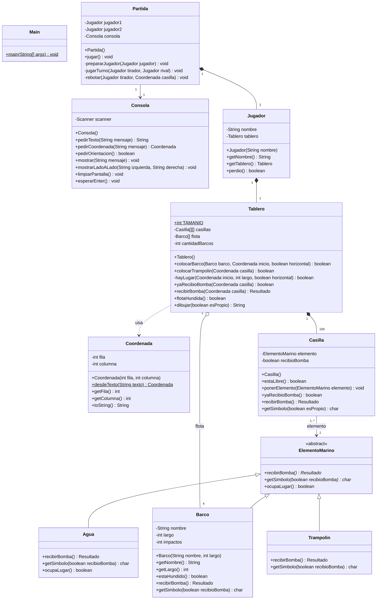

# Batalla Naval con Trampolines — Documento técnico

Paradigma Orientado a Objetos · UADE · 2.º cuatrimestre 2026

Este documento es la referencia para programar el juego: qué clases hay, qué hace cada método, cómo se conectan y en qué orden conviene implementarlas. Las reglas para jugar están en el manual, en esta misma carpeta ([`Manual_Batalla_Naval_con_Trampolines.docx`](Manual_Batalla_Naval_con_Trampolines.docx)); acá se citan por su número.

- **Lenguaje:** Java, por consola, sin librerías externas (solo `java.util.Scanner`).
- **Clases:** 12, una por archivo `.java`, todas en el paquete por defecto.
- **Idea central:** cada casilla guarda un `ElementoMarino` (agua, barco o trampolín) y cada uno responde a la bomba a su manera. Así el tablero nunca tiene que preguntar qué hay en una casilla.

## Índice

1. [Estructura del repositorio](#1-estructura-del-repositorio)
2. [Diagrama de clases](#2-diagrama-de-clases)

---

## 1. Estructura del repositorio

Todo el TPO va en la carpeta `TPO/`, separada de las carpetas de cada clase:

```text
paradigma-grupo5/
├── README.md
├── .gitignore
├── clase-02/ … clase-04/          ejercicios de cada clase
└── TPO/
    ├── DOCUMENTO_TECNICO.md       este documento
    ├── Manual_Batalla_Naval_con_Trampolines.docx
    └── src/                       se agrega a partir de la etapa 1
        ├── Main.java
        ├── Partida.java
        ├── Consola.java
        ├── Jugador.java
        ├── Tablero.java
        ├── Casilla.java
        ├── Coordenada.java
        ├── Resultado.java
        ├── ElementoMarino.java
        ├── Agua.java
        ├── Barco.java
        └── Trampolin.java
```

## 2. Diagrama de clases



Rombo lleno = composición (la parte no existe sin el todo). Rombo vacío = agregación. Triángulo = herencia. Flecha punteada = dependencia. `$` = `static` y `*` = abstracto.

---
