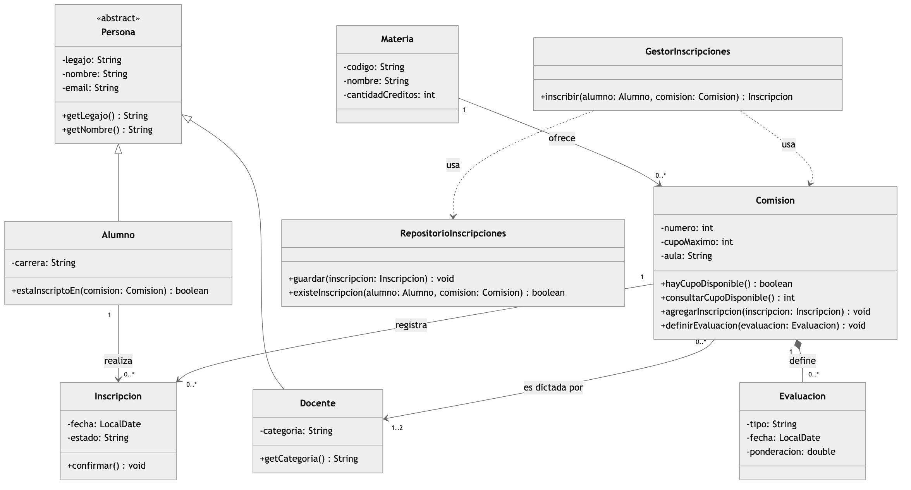
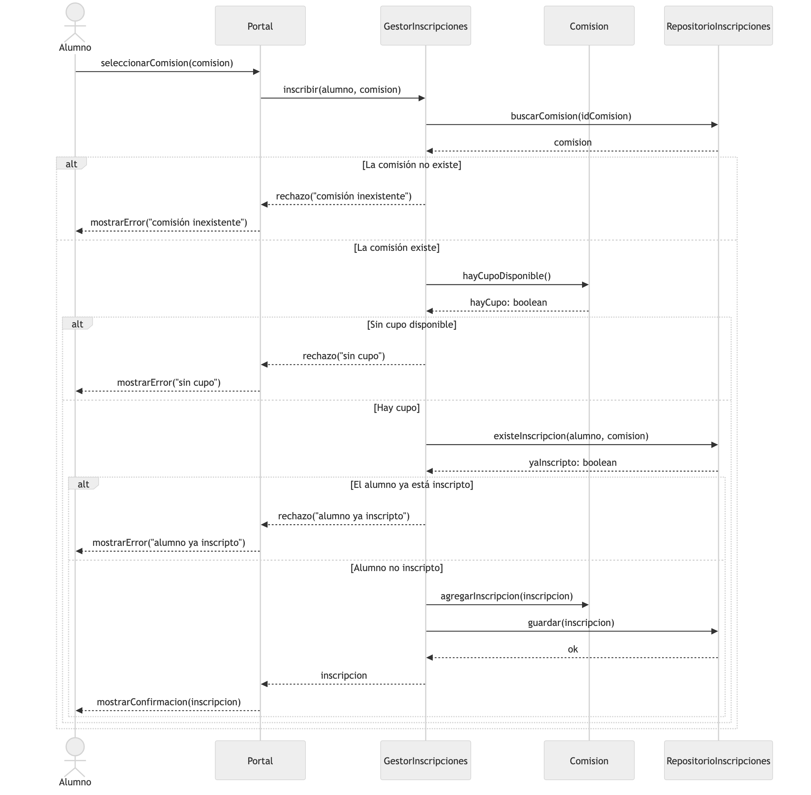

# Modelado UML aplicado a un sistema universitario

**Actividad integradora en grupo — Clase 3**
Programación Orientada a Objetos · UADE · Lunes tarde

| | |
|---|---|
| **Comisión / curso** | _(completar)_ |
| **Grupo N.º** | 5 — "Chiqui Mafia" |
| **Fecha** | 31/08 |

**Integrantes:** Santiago Terminiello · Nahuel Mioni · Emanuel Paoloni · Matias Llanos · Joaquin Valdettaro

---

## PARTE 1 — Análisis del dominio

### 1. Clases candidatas y responsabilidad principal

| Clase candidata | Responsabilidad principal |
|---|---|
| **Persona** | Concentra los datos de identificación comunes a toda persona registrada (legajo, nombre, email). |
| **Alumno** | Representa a la persona que se inscribe en comisiones y cursa una carrera. |
| **Docente** | Representa a la persona que dicta comisiones, según su categoría. |
| **Materia** | Define la asignatura del plan de estudios con su código, nombre y cantidad de créditos. |
| **Comision** | Representa el dictado concreto de una materia y controla su cupo, aula y número. |
| **Inscripcion** | Registra el vínculo entre un alumno y una comisión en una fecha determinada. |
| **Evaluacion** | Representa un instrumento de evaluación definido por una comisión. |
| **GestorInscripciones** | Aplica las reglas de negocio para dar de alta una inscripción. |
| **RepositorioInscripciones** | Persiste y recupera las inscripciones registradas. |

### 2. Conceptos del dominio vs. clases técnicas o de servicio

- **Conceptos del dominio:** `Persona`, `Alumno`, `Docente`, `Materia`, `Comision`, `Inscripcion`, `Evaluacion`. Existen en el vocabulario de la universidad aunque no hubiera software.
- **Clases técnicas / de servicio:** `GestorInscripciones` y `RepositorioInscripciones`. No representan cosas del mundo real: existen porque el sistema necesita coordinar la operación y guardar los datos.

### 3. Relación de generalización / especialización

**Persona → Alumno / Docente.**

Corresponde modelarla como herencia porque un alumno **es una** persona y un docente **es una** persona: los tres comparten legajo, nombre y email, que se definen una sola vez en la superclase. Cada subclase agrega lo que le es propio (`carrera` en Alumno, `categoria` en Docente) y participa en relaciones distintas: el alumno se inscribe, el docente dicta. No es una relación de composición ni de asociación porque no son objetos distintos vinculados entre sí, sino el mismo objeto visto con mayor especialización.

---

## PARTE 2 — Diagrama de clases UML



### Justificación 1 — Comisión / Evaluación: **composición**

Elegimos composición (rombo lleno del lado de `Comision`) porque el enunciado dice que una evaluación **no tiene sentido fuera de la comisión para la cual fue creada**. Eso significa que la evaluación no se comparte entre comisiones y que su ciclo de vida depende del todo: si se elimina la comisión, sus evaluaciones dejan de existir. Si fuera agregación, la evaluación podría sobrevivir por su cuenta o pertenecer a varias comisiones, que es justamente lo que el caso descarta.

### Justificación 2 — Multiplicidad `1..2` en el extremo Docente

El caso indica que una comisión **debe tener al menos un docente y puede tener hasta dos**. El mínimo `1` deja explícito que no puede existir una comisión sin responsable a cargo, y el máximo `2` fija el tope de la regla institucional. Del otro lado usamos `0..*` porque un docente recién incorporado puede no tener comisiones asignadas todavía.

### Navegabilidad

Usamos navegabilidad únicamente donde el sistema necesita recorrer la relación en esa dirección:

- `Materia → Comision`: desde la materia se listan sus comisiones para que el alumno elija.
- `Comision → Docente` y `Comision → Inscripcion`: la comisión necesita conocer su plantel y sus inscriptos para validar el cupo.
- `Alumno → Inscripcion`: el alumno consulta sus propias inscripciones.

No pusimos navegabilidad en sentido inverso porque ningún caso de uso del enunciado lo requiere, y agregarla obligaría a mantener referencias duplicadas.

### Pregunta de control

> Si una comisión tiene multiplicidad `1..2` en el extremo Docente, ¿qué afirmación concreta pueden hacer sobre cada instancia de Comisión?

**Toda instancia de Comisión está vinculada a uno o dos objetos Docente: nunca a ninguno y nunca a tres o más.**

---

## PARTE 3 — Diagrama de secuencia: "Inscribir un alumno en una comisión"



### Matriz de trazabilidad mínima

| Mensaje del diagrama | Objeto receptor | Método o responsabilidad asociada |
|---|---|---|
| `seleccionarComision(comision)` | Portal | Recibe la elección del alumno y delega la operación. |
| `inscribir(alumno, comision)` | GestorInscripciones | `inscribir(Alumno, Comision) : Inscripcion` — coordina las validaciones. |
| `buscarComision(idComision)` | RepositorioInscripciones | Recupera la comisión y permite verificar que exista. |
| `hayCupoDisponible()` | Comision | `hayCupoDisponible() : boolean` — compara inscriptos contra `cupoMaximo`. |
| `existeInscripcion(alumno, comision)` | RepositorioInscripciones | `existeInscripcion(Alumno, Comision) : boolean` — evita la doble inscripción. |
| `agregarInscripcion(inscripcion)` | Comision | `agregarInscripcion(Inscripcion) : void` — suma el alumno a la comisión. |
| `guardar(inscripcion)` | RepositorioInscripciones | `guardar(Inscripcion) : void` — persiste la inscripción registrada. |

### Correspondencia con el diagrama de clases

Los participantes `Alumno`, `Comision` y la `Inscripcion` resultante son objetos del dominio y tienen su clase en el diagrama de clases. `Portal` es el componente de interfaz, y `GestorInscripciones` y `RepositorioInscripciones` son las clases de servicio ya identificadas en la Parte 1. Ningún participante queda fuera del modelo.

---

## PARTE 4 — Del modelo a Java: firmas y wrappers

### A. Firmas de métodos

| Firma | Tipo de retorno | Parámetros |
|---|---|---|
| `public Comision(int numero, int cupoMaximo, String aula, Materia materia)` | — (constructor) | `numero`, `cupoMaximo`, `aula` y la `Materia` a la que pertenece. |
| `public boolean hayCupoDisponible()` | `boolean` | ninguno: la comisión ya conoce su cupo y sus inscriptos. |
| `public Inscripcion registrarInscripcion(Alumno alumno, Comision comision)` | `Inscripcion` | el alumno a inscribir y la comisión destino. |
| `public int consultarCupoDisponible()` | `int` | ninguno: se calcula como `cupoMaximo - cantidadInscriptos`. |

**Decisiones de tipos.** `hayCupoDisponible()` devuelve `boolean` porque la pregunta admite solo dos respuestas y se usa directamente en un `if`. `consultarCupoDisponible()` devuelve `int` porque un cupo es una cantidad entera y no negativa. `registrarInscripcion(...)` devuelve el objeto `Inscripcion` creado —y no `void` ni `boolean`— para que quien la invoca pueda mostrar la confirmación con la fecha y el estado del registro.

### B. Tipos primitivos y wrappers

| Dato | Tipo primitivo posible | Wrapper correspondiente | ¿Por qué podría convenir el wrapper? |
|---|---|---|---|
| `cupoMaximo` | `int` | `Integer` | Para distinguir "cupo todavía no asignado" (`null`) de un cupo de 0, y para poder guardarlo en colecciones genéricas como `List<Integer>`. |
| `cantidadInscriptos` | `int` | `Integer` | Normalmente conviene el primitivo, porque siempre tiene un valor calculable. El wrapper solo si el dato viene de una base de datos donde la columna puede ser nula. |
| `promedioFinal` | `double` | `Double` | Un alumno que aún no rindió no tiene promedio: con `Double` eso es `null`, mientras que con `double` se confundiría con un `0.0` real. |
| `regular` | `boolean` | `Boolean` | Permite un tercer estado, "todavía no determinado" (`null`), además de `true` y `false`. |

**Pregunta: ¿qué hace una clase wrapper?**

Una clase wrapper "envuelve" un tipo primitivo dentro de un objeto. Java necesita esto porque los primitivos (`int`, `double`, `boolean`) no son objetos: no pueden ser `null`, no tienen métodos y no se pueden usar donde se espera un `Object`, como en las colecciones. El wrapper aporta esas tres cosas y agrega métodos útiles de conversión.

Ejemplo de conversión en ambos sentidos:

```java
int cupoPrimitivo = 30;

// Boxing: de primitivo a wrapper
Integer cupoObjeto = Integer.valueOf(cupoPrimitivo);

// Unboxing: de wrapper a primitivo
int cupoDeVuelta = cupoObjeto.intValue();

// Desde Java 5 el compilador lo hace solo (autoboxing / autounboxing)
Integer cupoAuto = cupoPrimitivo;
int otroCupo = cupoAuto;

// Conversión desde texto, típica al leer datos de un formulario
Integer cupoDesdeTexto = Integer.parseInt("30");
```

---

## PARTE 5 — Revisión cruzada y entrega

| ✓ | Control final |
|---|---|
| ☑ | El diagrama de clases contiene clases, atributos, operaciones y relaciones legibles. |
| ☑ | Todas las asociaciones importantes tienen multiplicidad en ambos extremos. |
| ☑ | La generalización está orientada desde las subclases hacia la superclase. |
| ☑ | La relación Comisión-Evaluación está representada y justificada. |
| ☑ | El diagrama de secuencia tiene líneas de vida, mensajes ordenados y alternativas de error/rechazo. |
| ☑ | Los nombres de objetos, clases y mensajes son consistentes entre diagramas. |
| ☑ | Las firmas Java propuestas son compatibles con las responsabilidades del modelo. |
| ☑ | La tabla de wrappers está completa. |
| ☑ | Todos los integrantes figuran en la entrega. |
